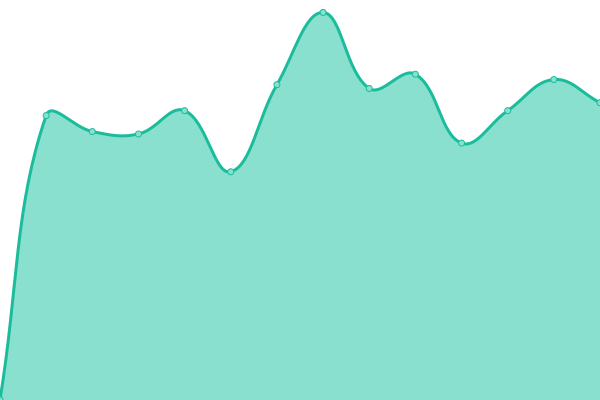
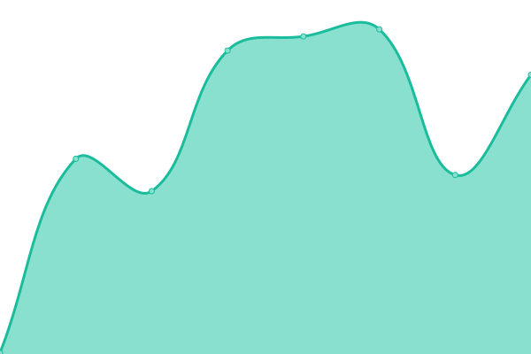
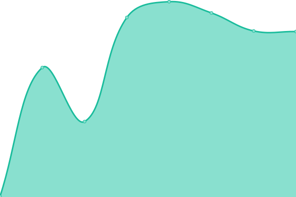

# [📈 Live Status](https://kevinzaracho.com): <!--live status--> **🟩 All systems operational**

This repository contains the open-source uptime monitor and status page for [Kevin Zaracho](kevinzaracho.com), powered by [Upptime](https://github.com/upptime/upptime).

With [Upptime](https://upptime.js.org), you can get your own unlimited and free uptime monitor and status page, powered entirely by a GitHub repository. We use [Issues](https://github.com/kenzaflow/grow2on-uptime/issues) as incident reports, [Actions](https://github.com/kenzaflow/grow2on-uptime/actions) as uptime monitors, and [Pages](https://kevinzaracho.com) for the status page.

<!--start: status pages-->
<!-- This summary is generated by Upptime (https://github.com/upptime/upptime) -->
<!-- Do not edit this manually, your changes will be overwritten -->
<!-- prettier-ignore -->
| URL | Status | History | Response Time | Uptime |
| --- | ------ | ------- | ------------- | ------ |
|  [Landing](https://grow2on.com) | 🟩 Up | [landing.yml](https://github.com/kvnzrch/grow2on-uptime/commits/HEAD/history/landing.yml) | 

 1306ms
     
 | 

<a href="https://kenzaflow.github.io/grow2on-uptime/history/landing">99.92%</a>
    

|  [Front-End](https://integrador.grow2on.com) | 🟩 Up | [front-end.yml](https://github.com/kvnzrch/grow2on-uptime/commits/HEAD/history/front-end.yml) | 

 244ms
     
 | 

<a href="https://kenzaflow.github.io/grow2on-uptime/history/front-end">100.00%</a>
    

|  [Front-End (dev)](https://integrador.dev.grow2on.com) | 🟩 Up | [front-end-dev.yml](https://github.com/kvnzrch/grow2on-uptime/commits/HEAD/history/front-end-dev.yml) | 

 225ms
     
 | 

<a href="https://kenzaflow.github.io/grow2on-uptime/history/front-end-dev">100.00%</a>
    

|  [Back-End](https://backend.grow2on.com) | 🟩 Up | [back-end.yml](https://github.com/kvnzrch/grow2on-uptime/commits/HEAD/history/back-end.yml) | 

 218ms
     
 | 

<a href="https://kenzaflow.github.io/grow2on-uptime/history/back-end">100.00%</a>
    

|  [Back-End (dev)](https://backend.dev.grow2on.com) | 🟩 Up | [back-end-dev.yml](https://github.com/kvnzrch/grow2on-uptime/commits/HEAD/history/back-end-dev.yml) | 

 194ms
     
 | 

<a href="https://kenzaflow.github.io/grow2on-uptime/history/back-end-dev">100.00%</a>
    

|  [Service Manager](https://service-manager.grow2on.com) | 🟩 Up | [service-manager.yml](https://github.com/kvnzrch/grow2on-uptime/commits/HEAD/history/service-manager.yml) | 

 202ms
     
 | 

<a href="https://kenzaflow.github.io/grow2on-uptime/history/service-manager">100.00%</a>
    

<!--end: status pages-->

[**Visit our status website →**](https://kevinzaracho.com)

## 📄 License

- Powered by: [Upptime](https://github.com/upptime/upptime)
- Code: [MIT](./LICENSE) © [Anand Chowdhary](https://anandchowdhary.com), supported by [Pabio](https://pabio.com)
- Data in the `./history` directory: [Open Database License](https://opendatacommons.org/licenses/odbl/1-0/)
